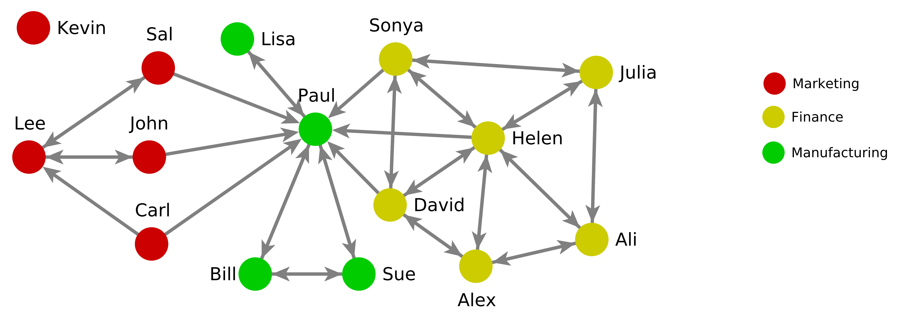
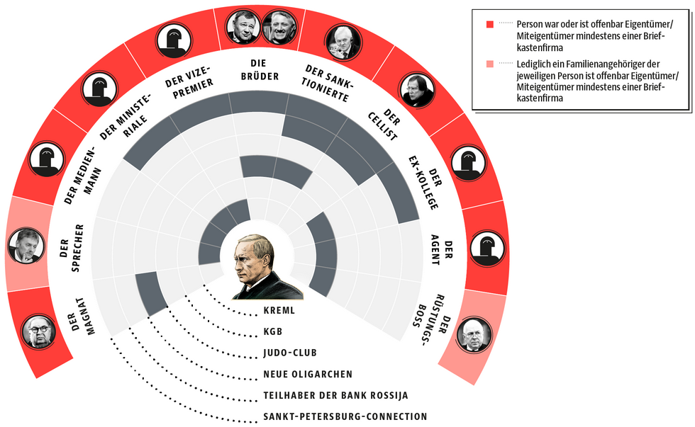

In this practical, you will learn data entry, network data management, exploratory/descriptive analysis, and visualisation using several `R` packages: `statnet` (i.e., `network` with `sna`), `igraph`, and the combination of `tidygraph` and `ggraph` (for visualisation).

This script is much longer than a single two-hour session can accommodate.
Please consider anything that is not covered in the practical as homework and background preparation until next week.
The course unit has only six lectures, which means there is more time dedicated to independent study time using materials like these.
It is expected that you spend time each week going over the scripts and completing the exercises if they are not completed in the classroom.

# Handling network data in R

Download and save a copy of the `.Rmd` file and all other files (e.g., PNG diagrams) into a new directory on your computer.

Execute the `R` commands below on your own laptop in `RStudio` and observe the output.

Ask questions to ensure your understanding is complete.
Take lots of notes to ensure you still remember everything later.
You can write directly into this document or add comments (preceded by `#`) to the code chunks.
See https://www.markdownguide.org/ for details on Markdown syntax.
See https://rmarkdown.rstudio.com/ for details on RMarkdown with `RStudio`.

We expect you to complete and review all exercises at home and revisit the code.
Each session builds on the code explained in the previous session, so make sure you are familiar with it by the start of the practical next time.

## Loading the `chemnet` data from the `btergm` package

We will need the `btergm` package below.
If you haven't installed it yet, install it as follows.
Proceed in the same way for all packages we load below using the `library` function.

```{r, eval=FALSE}
install.packages("btergm")
```

Load the `chemnet` dataset from the `btergm` package, and explore the various objects and help file.

```{r}
library("btergm")
data("chemnet")
?chemnet # displays the help page with details about the different objects
pol
str(pol)
isSymmetric(pol)
types
str(types)
```

## Create a network object

```{r}
library("network")
nw <- network(pol, directed = TRUE, bipartite = FALSE)
nw
set.vertex.attribute(x = nw, attrname = "types", value = types$type)
nw
get.vertex.attribute(nw, "types")
list.vertex.attributes(nw)
```

## Plot network objects

```{r}
plot(nw)
?plot.network
plot(nw, displaylabels = TRUE)
plot(nw, mode = "circle")
plot(nw, usecurve = TRUE)
plot(nw, vertex.col = "types", edge.col = "gray")
mixingmatrix(nw, "types")
help(package = "network")
```

## Convert between matrix, network, data frame, and edgelist

```{r}
as.matrix(nw)
dat <- as.data.frame(nw) # to data frame
dat
network(dat)
el <- as.edgelist(nw) # to edgelist
el # note how we lost the types attribute
as.network(el)
```

## Some helper functions from the `network` package

```{r}
is.adjacent(nw, 1, 2) # see el object for vertex IDs
is.adjacent(nw, 1, 12)
has.edges(nw)
is.bipartite(nw)
is.directed(nw)
```

## Two-mode networks

Set the random seed to make sure the next line generates the same results on all computers, then create some random two-mode network.
```{r}
set.seed(12345)
inc <- matrix(sample(0:1, 15, replace = TRUE), 3, 5) # two-mode (incidence) matrix
colnames(inc) <- letters[1:5]
rownames(inc) <- LETTERS[1:3]
inc
inc_nw <- network(inc, bipartite = TRUE)
inc_nw
plot(inc_nw)
```

Handle node attributes for two-mode networks.
Note: `network::` is only necessary if you have also loaded the `igraph` package to avoid confusion.
```{r}
network::get.vertex.attribute(inc_nw, "vertex.names")
network::set.vertex.attribute(inc_nw, "group_attribute", c(NA, NA, NA, 3, 1, 6, 4, 2))
inc_nw
network::get.vertex.attribute(inc_nw, "group_attribute")
```

# Exercise: enter one-mode network data into `R`

Consider the following organisational network (source: Rob Cross; adapted from https://www.robcross.org).



Complete the following tasks:

1. Enter this network as an edge list and convert it into a matrix and network object in `R`.
2. Store the department as an attribute in the network object.
3. Save the input data and your script for re-use in future practicals.

# Exercise: enter two-mode network data into `R`

The German newspaper Süddeutsche Zeitung published the following diagram derived from the Panama Papers in an article with the title "The Secrets of Dirty Money: The Network -- Putin and his Closest Confidants" in 2016 (source: http://panamapapers.sueddeutsche.de/articles/56fe71aaa1bb8d3c3495ac71/):



Complete the following tasks:

1. Open the homepage of the article, and use Google Translate to see the English translation of the labels. Familiarise yourself with the diagram.
2. Enter the data into `R` in the most suitable way, and save your results.

# Visualisation with the `igraph` package.

Note that the `igraph` package and `statnet`-based packages have some duplicate function names.
This causes some messages when the package is loaded.
`R` uses the function in the last package that was loaded in that case.

## Create graphs with the `igraph` package

```{r}
library("igraph")
help(package = "igraph")
g <- graph_from_adjacency_matrix(pol, mode = "directed", weighted = NULL)
g
plot(g)
as.matrix(g)
class(as.matrix(g))
as.matrix(as.matrix(g))
graph_from_data_frame(dat)
as_data_frame(g)
as_long_data_frame(g) # same as before but with IDs and labels
```

## Two-mode networks with `igraph`

```{r}
g2 <- graph_from_biadjacency_matrix(inc)
plot(g2)
plot(g2, layout = layout_as_bipartite(g2))
as.matrix(g2) # note the extensive, square format
as_biadjacency_matrix(g2) # rectangular format
```

## Some helper functions in the `igraph` package

```{r}
is_bipartite(g)
is_bipartite(g2)
is_directed(g)
is_directed(g2)
is_weighted(g)
are_adjacent(g, 1, 2)
are_adjacent(g, 1, 12)
```

# Exercise: network visualisation with `igraph`

Convert the Rob Cross and Putin Panama Papers networks to `igraph`, and visualise them!

# Exercise: Swiss co-authorship network

Load the Swiss co-authorship two-mode network mentioned in the lecture ([`coauthor.zip`](coauthor.zip)), and plot it using the `network` and `igraph` packages!

# Handling network data with `statnet`

**Important note**:
`igraph` and `statnet` have some functions with identical names.
Mixing both packages in the same session almost always leads to frustration.
Please restart your R session here (e.g., if you use RStudio, go to the "Session" menu and select "Restart R").
It's not possible to do this programmatically, but as a second best option, we can detach the `igraph` package from the workspace to ensure it's no longer loaded while we use `statnet`:
```{r}
detach("package:igraph")
```

Load packages (if not already done).

```{r}
library("network")
library("sna")
library("ergm")
library("btergm")
```

Load and prepare Swiss co-authorship dataset.

```{r}
data("ch_coauthor")
ch_nw <- network(ch_coaut, directed = FALSE, bipartite = FALSE)
set.vertex.attribute(ch_nw, "num_publications", ch_nodeattr$num_publications)
set.vertex.attribute(ch_nw, "status", as.character(ch_nodeattr$status))
set.vertex.attribute(ch_nw, "male", ch_nodeattr$male)
```

## Size and density

```{r}
network.size(ch_nw)  # number of nodes
network.edgecount(ch_nw)  # number of edges
network.density(ch_nw)  # network density
```

## Basic plotting with the network package

```{r}
plot(ch_nw)
plot(ch_nw,
     displaylabels = TRUE,
     vertex.cex = log(ch_nodeattr$num_publications),
     edge.lwd = ch_coaut) # not necessarily better... we'll get back to this later
```

## Degree distribution

```{r}
deg_dist <- degree(ch_nw)
deg_dist
hist(deg_dist, main = "Degree distribution", xlab = "Degree", ylab = "Frequency")
```

## Isolates

```{r}
isolates <- which(degree(ch_nw) == 0)
isolates
get.vertex.attribute(ch_nw, "vertex.names")[isolates] # who are the isolates?
hist(ch_nodeattr$num_publications[isolates])
```

These nodes aren't isolates because they don't have any publications.
They just don't have them with other Swiss political scientists during the observation period.

## Geodesic distance

```{r}
gd <- geodist(ch_nw)
head(gd$count) # how many shortest paths between row and column
head(gd$gdist) # path length
hist(gd$gdist)
max(gd$gdist[is.finite(gd$gdist)]) # network diameter
```

## Identify cut vertices

```{r}
cp <- cutpoints(ch_nw)
cp
rownames(ch_coaut)[cp]
cp_colour <- rep("grey", nrow(ch_coaut))
cp_colour[cp] <- "green"
plot(ch_nw, vertex.col = cp_colour)
```

## Triads, reciprocity, and clustering coefficient
```{r}
triad.census(ch_nw)
grecip(ch_nw, measure = "dyadic")
global_clustering <- gtrans(ch_nw)
```
`statnet` has no implementation of the local clustering coefficient, but we can do this with `igraph` below.

## Counts of motifs/ensembles/subgraph products/network statistics for networks

```{r}
summary(ch_nw ~ esp(1:5)) # edge-wise shared partners
summary(ch_nw ~ nsp(1:5)) # non-edgewise shared partners
summary(ch_nw ~ dsp(1:5)) # dyad-wise shared partners
barplot(summary(ch_nw ~ dsp(1:5)))
summary(ch_nw ~ triangle) # complete triads
summary(ch_nw ~ isolates) # isolates
summary(ch_nw ~ kstar(1:20)) # k-stars
summary(ch_nw ~ cycle(4)) # four-cycles
summary(ch_nw ~ twopath) # two-paths
summary(ch_nw ~ degcor) # degree correlation = degree assortativity
summary(ch_nw ~ triangle + twopath + edges) # multiple statistics at once
?"ergm-terms" # complete list of network statistics -- familiarise yourself with these!
```

# Exploring networks with `igraph`

Load the `igraph` package.

```{r}
library("igraph")
```

## Creating graphs with attributes

```{r}
g <- graph_from_adjacency_matrix(ch_coaut, mode = "undirected", weighted = TRUE)
plot(g, vertex.size = 5, vertex.label = NA) # stupid! this graph has loops!
diag(ch_coaut)
diag(ch_coaut) <- 0
g <- graph_from_adjacency_matrix(ch_coaut, mode = "undirected", weighted = TRUE)
plot(g, vertex.size = 5, vertex.label = NA) # better!
vertex_attr(g, "status") <- ch_nodeattr$status # add a node attribute
vertex_attr(g, "numpub") <- ch_nodeattr$num_publications
vertex_attr(g)
```

## Basic network statistics

```{r}
vcount(g)  # number of vertices
ecount(g)  # number of edges
reciprocity(g)
largest_component(g)
plot(largest_component(g))
all_shortest_paths(g, from = "Leifeld, Philip", to = "Bechtel, Michael")
articulation_points(g) # cut vertices
```

## Assortativity/homophily

```{r}
assortativity_degree(g)
assortativity(g, values = ch_nodeattr$status)
assortativity(g, values = ch_nodeattr$share_en_articles)
```

## Degree distribution

```{r}
degree_vals <- degree(g)
hist(degree_vals)
plot(g, vertex.size = degree_vals, vertex.label = NA)
```

## Plotting the largest component with attributes and different layouts

```{r}
plot(largest_component(g),
     vertex.label = NA,
     vertex.size = 0.2 * vertex_attr(largest_component(g), "numpub"),
     vertex.color = vertex_attr(largest_component(g), "status"))
plot(largest_component(g),
     vertex.label = NA,
     vertex.size = 0.2 * vertex_attr(largest_component(g), "numpub"),
     vertex.color = vertex_attr(largest_component(g), "status"),
     layout = layout_with_kk)
plot(largest_component(g),
     vertex.label = NA,
     vertex.size = 0.2 * vertex_attr(largest_component(g), "numpub"),
     vertex.color = vertex_attr(largest_component(g), "status"),
     layout = layout_as_tree)
plot(largest_component(g),
     vertex.label = NA,
     vertex.size = 0.2 * vertex_attr(largest_component(g), "numpub"),
     vertex.color = vertex_attr(largest_component(g), "status"),
     layout = layout_with_dh)
plot(largest_component(g),
     vertex.label = NA,
     vertex.size = 0.2 * vertex_attr(largest_component(g), "numpub"),
     vertex.color = vertex_attr(largest_component(g), "status"),
     layout = layout_with_drl)
plot(largest_component(g),
     vertex.label = NA,
     vertex.size = 0.2 * vertex_attr(largest_component(g), "numpub"),
     vertex.color = vertex_attr(largest_component(g), "status"),
     layout = layout_with_gem)
plot(largest_component(g),
     vertex.label = NA,
     vertex.size = 0.2 * vertex_attr(largest_component(g), "numpub"),
     vertex.color = vertex_attr(largest_component(g), "status"),
     layout = layout_with_graphopt) # like the "quick layout" in visone; recommended!
?layout_ # overview of different layouts
```

## Clustering coefficients

```{r}
transitivity(g, type = "global")
transitivity(g, type = "local")
```

## Triad census

```{r}
triad_census(g) # igraph's triad census
summary(ch_nw ~ triadcensus()) # network package for comparison
```

## Structural holes and constraint

```{r}
constraint(g) # Burt's constraint index
constraint(g)[c("Spilker, Gabriele", "Widmer, Thomas")]
gs <- make_ego_graph(g, nodes = c("Spilker, Gabriele", "Widmer, Thomas"))
set.seed(12345)
plot(gs[[1]], layout = layout.graphopt)
plot(gs[[2]], layout = layout.graphopt)
```

# Exercise: Questions about the organisational network by Rob Cross

Using the organisational network you entered, answer the following questions:

1. What is the geodesic distance from Julia to Lisa? How many geodesics are there from Julia to Lisa?
2. How many directed (/undirected) dyads are in this graph?
3. What is the density of the graph?
4. What does the indegree distribution of the network look like?
5. Is there a tendency for reciprocity?

# Exercise: Exploratory network analysis and visualisation

Analyse the following networks:

- Rob Cross's organisational network
- Leifeld's Swiss co-authorship network
- the `chemnet` dataset

using the following packages, respectively:

- `network`
- `igraph`

Conduct a descriptive, exploratory analysis of the networks, and visualise them.

While creating the visualisations, explore their structural properties using descriptive measures.
Store the available attributes in the data structure for the network.
Embed some of these descriptive insights into the visualisations.
The goal is to create a set of visualisations that reveal interesting insights about the networks and at the same time look publication-ready.


# Handling and visualising networks with `tidygraph` and `ggraph`

Load packages.
Familiarise yourself with the help pages.

```{r}
library("igraph")
library("tidygraph")
library("ggraph")
help(package = "tidygraph")
help(package = "ggraph")
```

Load data and create network objects (in case they were modified above).

```{r}
data("ch_coauthor", package = "btergm")
ch_nw <- network::network(ch_coaut)
g <- graph_from_adjacency_matrix(ch_coaut, mode = "undirected", weighted = TRUE)
vertex_attr(g, "status") <- ch_nodeattr$status
```

## Create `ggraph` object from a graph and inspect the data structure

```{r}
tg <- as_tbl_graph(ch_coaut) # works with adjacency matrices
tg
ggraph(tg) +
  geom_node_point() +
  geom_edge_link()
tg <- as_tbl_graph(ch_nw) # works with network objects
tg
tg <- as_tbl_graph(g) # works with igraph objects
tg # now the node attributes are also present
```

## Recode the `city` attribute as a factor

```{r}
city <- max.col(ch_nodeattr[, 13:19], ties.method = "first")
city
city <- factor(city,
               labels = c("Bern",
                          "Zurich",
                          "Basel",
                          "Lucerne",
                          "St. Gallen",
                          "Lausanne",
                          "Geneva"))
city
```

## Manipulate node and edge attributes

```{r}
tg <- tg |>
  activate("nodes") |>
  mutate(degree = centrality_degree(),
         share_en_articles = ch_nodeattr$share_en_articles,
         city = city) |>
  activate("edges") |>
  mutate(same_city = .N()$city[from] == .N()$city[to])
```

## Plot network using `ggraph`

```{r}
ggraph(tg) +
  geom_node_point(aes(colour = city, size = share_en_articles)) +
  geom_edge_link(aes(colour = same_city))
```

## Only largest component, with `graphopt` layout

```{r}
ggraph(largest_component(tg), layout = "graphopt") +
  geom_node_point(aes(colour = city, size = share_en_articles)) +
  geom_edge_link(aes(colour = same_city))
```

## Edge facets for same city

```{r}
ggraph(largest_component(tg), layout = "graphopt") +
  geom_node_point(aes(colour = city, size = share_en_articles)) +
  geom_edge_link(aes(colour = same_city)) +
  facet_edges("same_city")
```

## Node facets for status

```{r}
ggraph(largest_component(tg), layout = "graphopt") +
  geom_node_point(aes(colour = city, size = share_en_articles)) +
  geom_edge_link(aes(colour = same_city)) +
  facet_nodes("status")
```

## Learn more about `tidygraph` and `ggraph` using package vignettes:

```{r, eval = FALSE}
vignette("tidygraph", package = "ggraph")
vignette("Layouts", package = "ggraph")
vignette("Edges", package = "ggraph")
vignette("Nodes", package = "ggraph")
```
